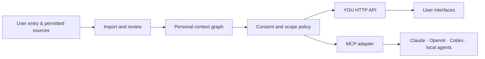

# YOU architecture: a portable personal engram

An **engram** is the user's editable context, not a hidden model profile. It contains people, relationships, preferences, routines, plans, commitments, and boundaries. Each claim is tied to evidence and an information state.

## Core records

- **Entity:** a person, place, organization, activity, goal, or event. Identities and aliases point to an entity but are not automatically merged.
- **Fact:** subject, predicate, value, state (`known`, `inferred`, `unknown`, `disputed`), confidence, observation time, verification time, and privacy level.
- **Evidence:** immutable reference to a permitted source, with an excerpt or source pointer where allowed.
- **Relationship:** typed edge between entities, with its own evidence and confidence.
- **Interaction:** timestamped contact or activity metadata. Sensitive content need not be retained to count a contact.
- **Commitment:** a possible or confirmed promise, a due window, and resolution state.
- **Insight:** a temporary suggestion derived from current facts and policy. It is not itself a new fact.
- **Grant:** client identity, scopes, optional people filter, expiration, and revocation.

The TypeScript boundary in [`lib/context-contract.ts`](../lib/context-contract.ts) is intentionally vendor neutral. `/api/protocol` reports the proposed scopes, but it is discovery only in this prototype. Browser `localStorage` cannot securely serve an MCP client and is not presented as a production API.

## Import pipeline

1. The user grants one connector a narrow permission.
2. The connector records raw events with source metadata and retention settings.
3. Extraction proposes entities, facts, dates, and commitments.
4. Entity resolution compares identities and creates a candidate match with confidence.
5. Deduplication links equivalent evidence; it does not erase provenance.
6. New or uncertain claims enter a review queue. The user can confirm, correct, reject, or ignore them.
7. Confirmed claims update the graph. Inferred claims remain inferred.
8. The insight engine surfaces a small number of useful actions under the user's notification policy.

“Scraping” is not a blanket collection strategy. A future connector should use official APIs, user exports, or user authorized access where technically and contractually permitted. It must disclose what it reads, how often, and what it retains. No fake social identities or automated friend requests.

## Agent access

An assistant requests a capability, such as `people.read` or `plans.read`. YOU authenticates the client, applies the user's grant, filters private and excluded facts, and returns a bounded answer with provenance and uncertainty. The client gets only what it needs for that request. Reads and writes should be auditable. A user can revoke a client without losing the engram.

The first production MCP tools could be:

| Tool | Purpose | Default scope |
| --- | --- | --- |
| `you.search_context` | Find relevant allowed facts and events | category-specific read |
| `you.get_person` | Retrieve a person with permitted relationships | `people.read` |
| `you.explain_fact` | Return evidence, state, and confidence | matching read scope |
| `you.list_open_loops` | Show unresolved commitments | `plans.read` |
| `you.propose_memory` | Submit a candidate for user review | `memory.write` |

Mutations should create reviewable proposals. A third party agent should not silently rewrite the graph.

## Proactive behavior

The system can detect patterns such as an unusual work stretch or reduced contact with a friend. It should present a question or an optional suggestion with the evidence attached. It should avoid diagnoses, relationship scores, pressure, and repeated nudges. Device activity should use aggregate data only if a platform allows it and the user opts in. A local event suggestion requires a verified listing before presenting time, venue, price, or booking availability as fact. Purchases and messages require a separate user action.

## Milestones

1. Local database, encryption, migration, import/export, and person/identity review.
2. Real evidence ingestion for one official source plus a transparent fact review queue.
3. Authenticated HTTP service and MCP adapter with scope enforcement and audit logs.
4. Insight engine, quiet hours, controls for sensitive categories, and correction propagation.
5. Additional connectors, mobile companion, secure sync as an option, and open protocol specification.
